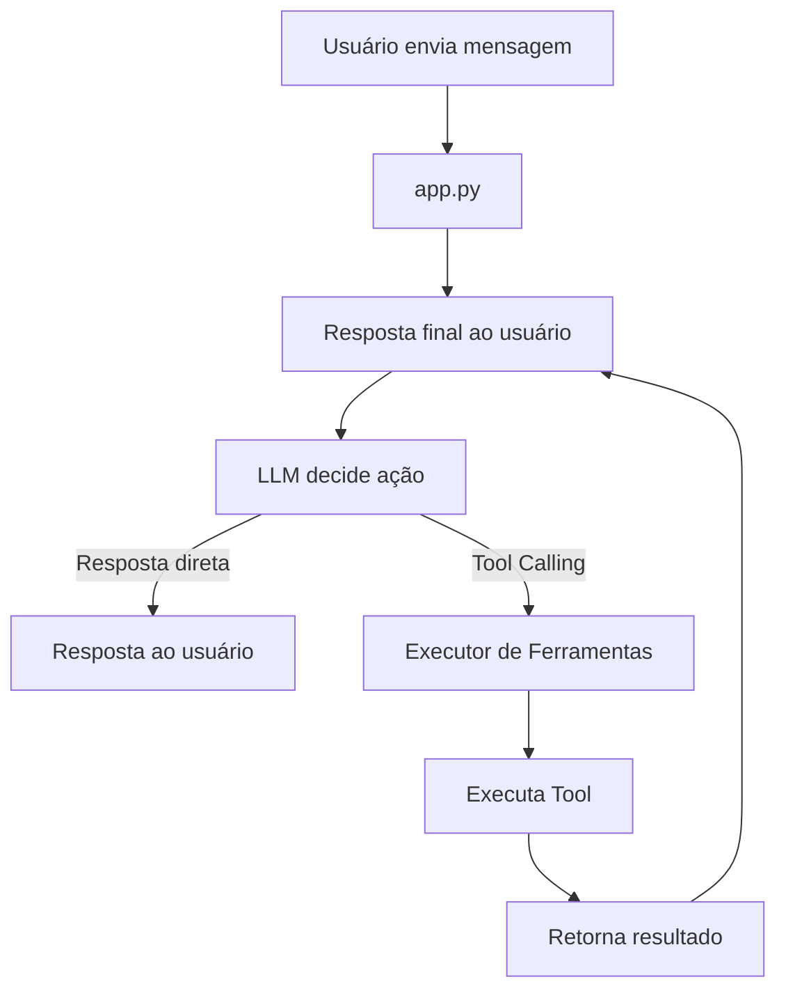

# 🎓 JARVIS Acadêmico

### Assistente Inteligente Acadêmico com RAG, Tool Calling e Gestão de Estudos

<p align="center">
  
  
  
  
  
</p>

<p align="center">
  Um assistente acadêmico inteligente capaz de responder perguntas sobre materiais de estudo, gerenciar agenda e tarefas, gerar exercícios automaticamente e recomendar revisões utilizando RAG + Tool Calling.
</p>

---

# 📋 Sumário

- [✨ Visão Geral](#-visão-geral)
- [🚀 Funcionalidades](#-funcionalidades)
- [🏗 Arquitetura](#-arquitetura)
- [📁 Estrutura do Projeto](#-estrutura-do-projeto)
- [⚙ Instalação](#-instalação)
- [📚 Dataset](#-dataset)
- [🛠 Ferramentas (Tools)](#-ferramentas-tools)
- [🔄 Fluxo do Sistema](#-fluxo-do-sistema)
- [🧪 Testes](#-testes)
- [📝 Logs](#-logs)
- [🤖 Tecnologias e IA Utilizadas](#-tecnologias-e-ia-utilizadas)
- [🎥 Demonstração](#-demonstração)
- [👥 Autores](#-autores)
- [📌 Observações](#-observações)

---

# ✨ Visão Geral

O **JARVIS Acadêmico** foi desenvolvido para a disciplina de Inteligência Artificial com o objetivo de criar um agente inteligente capaz de:

✅ Responder perguntas sobre materiais acadêmicos utilizando RAG  
✅ Gerenciar agenda acadêmica  
✅ Gerenciar tarefas e atividades  
✅ Gerar exercícios automaticamente  
✅ Recomendar materiais para revisão  
✅ Utilizar Tool Calling com LLM para tomada de decisão  

---

# 🚀 Funcionalidades

## 📖 1. RAG (Retrieval-Augmented Generation)

O sistema:

- Carrega documentos PDF, TXT e imagens
- Realiza OCR em imagens
- Divide conteúdos em chunks
- Gera embeddings com `fastembed`
- Armazena vetores no ChromaDB
- Recupera contexto relevante para responder perguntas

### Estratégia de Chunking

| Configuração    | Valor                    |
| ---------------- | ------------------------ |
| Chunk Size       | `500 caracteres`         |
| Overlap          | `50 caracteres`          |
| Embedding Model  | `BAAI/bge-small-en-v1.5` |

---

## 📅 2. Agenda Acadêmica

Permite consultas como:

```txt
"O que tenho hoje?"
"Tenho prova amanhã?"
"Quais aulas tenho esta semana?"
```

Os dados são armazenados em SQLite.

### Funcionalidades

- Adicionar eventos
- Remover eventos
- Consultar por período
- Consultar por data específica
- Criação de exercícios
- Recomendação de revisão

---

## ✅ 3. Gerenciamento de Tarefas

### Operações disponíveis

- Adicionar tarefa
- Listar tarefas
- Marcar como concluída
- Adicionar evento
- Remover evento
- Listar eventos

Exemplo:

```txt
Adicionar tarefa: estudar regressão logística
```

---

## 🧠 4. Geração de Exercícios

O sistema detecta solicitações como:

```txt
"Gerar exercícios sobre embeddings"
```

E então:

1. Busca contexto relevante via RAG
2. Utiliza a LLM para criar perguntas
3. Gera exercícios de múltipla escolha
4. Avalia respostas do usuário

---

## 📈 5. Recomendação de Revisão

Após exercícios:

- Detecta tópicos com maior erro
- Recomenda arquivos específicos para revisão
- Direciona estudos de forma personalizada

---

## 🔧 6. Tool Calling

A LLM decide automaticamente:

- Qual ferramenta chamar
- Quais parâmetros utilizar
- Quando responder diretamente

Todas as chamadas são registradas em log.

---

# 🏗 Arquitetura

# 📁 Estrutura do Projeto

```bash
jarvis_academico/
│
├── app.py
│
├── core/
│   ├── agent.py
│   ├── llm_client.py
│   └── prompts.py
│
├── tools/
│   ├── agenda.py
│   ├── rag_tool.py
│   ├── learning.py
│   ├── executor.py
│   ├── description.py
│   └── __init__.py
│
├── services/
│   ├── rag_engine.py
│   ├── file_monitor.py
│   └── ocr_processor.py
│
├── tests/
├── data/
├── logs/
├── chroma_db/
│
├── requirements.txt
├── .gitignore
└── README.md
```

---

# 🔄 Fluxo do Sistema



---

# ⚙ Instalação

## Pré-requisitos

- Python 3.10+
- Git
- Arquivo `.env` configurado com a chave da API
- Credenciais da API da LLM:
  - `API_URL`
  - `API_KEY`

---

## 1️⃣ Clone o repositório

```bash
git clone https://github.com/rukaaah/Jarvis-Academico-IA.git

cd jarvis-academico-ia
```

---

## 2️⃣ Crie o ambiente virtual

### Linux/macOS

```bash
python -m venv venv

source venv/bin/activate
```

### Windows

```bash
python -m venv venv

venv\Scripts\activate
```

---

## 3️⃣ Instale as dependências

```bash
pip install -r requirements.txt
```

---

## 4️⃣ Configure a API da LLM

Crie um arquivo `.env`:

```env
API_URL=url_da_llm
API_KEY=sua_chave_aqui
```

---

## 5️⃣ Execute a aplicação

```bash
streamlit run app.py
```

---

## 6️⃣ Acesse no navegador

```txt
http://localhost:8501
```

---

# 📚 Dataset

A pasta `data/` contém pelo menos 10 documentos acadêmicos.

### Exemplos de conteúdo

- Machine Learning
- Embeddings
- RAG
- Regressão Logística
- Técnicas de estudo
- IA generativa

---

## 🔍 Reindexação

Para reconstruir o índice vetorial:

```bash
rm -rf chroma_db/
```

Na próxima execução o sistema reindexará automaticamente.

---

# 🛠 Ferramentas (Tools)

| # | Tool                      | Descrição                     |
|---|---------------------------|--------------------------------|
| 1 | `consultar_agenda`        | Consulta eventos              |
| 2 | `listar_tarefas`          | Lista tarefas                 |
| 3 | `adicionar_tarefa`        | Cria nova tarefa              |
| 4 | `concluir_tarefa`         | Marca tarefa concluída        |
| 5 | `buscar_material_rag`     | Busca conteúdo nos documentos |
| 6 | `adicionar_evento_agenda` | Adiciona evento               |
| 7 | `remover_evento_agenda`   | Remove evento                 |
| 8 | `gerar_exercicios`        | Cria exercícios               |
| 9 | `recomendar_revisao`      | Sugere materiais              |

---

# 🧪 Testes

Os testes utilizam `pytest`.

## Executar testes

```bash
pytest tests/ -v
```

### Exemplo de saída

```txt
test_agenda_tarefas.py::test_adicionar_tarefa PASSED
test_agenda_tarefas.py::test_concluir_tarefa PASSED
test_agenda_tarefas.py::test_consultar_agenda PASSED
```

---

# 📝 Logs

Todas as chamadas de ferramentas são registradas em:

```txt
logs/tool_calls.log
```

### Exemplo

```txt
2025-05-23 14:30:22,123 - TOOL: listar_tarefas
ARGS: {}
OUTPUT: ID: 1 | Estudar Python - pendente
```

---

# 🤖 Tecnologias e IA Utilizadas

## Tecnologias

- Python
- Streamlit
- SQLite
- ChromaDB
- FastEmbed
- OCR.space API

---

## Modelos de IA

- Gemma 12B
- BAAI/bge-small-en-v1.5

---

## Ferramentas de apoio

- ChatGPT – estruturação, documentação e auxílio no desenvolvimento
- Gemini – descoberta de ferramentas e detecção de bugs

---

# 👥 Autores

| Nome                     | GitHub                                  |
| ------------------------ | ---------------------------------------- |
| Pedro Lucas Cremonini    | https://github.com/rukaaah              |
| Angelo Antônio de Souza  | https://github.com/angelo-acds          |

---

# 📌 Observações

Este projeto foi desenvolvido exclusivamente para fins acadêmicos como trabalho prático da disciplina de Inteligência Artificial.