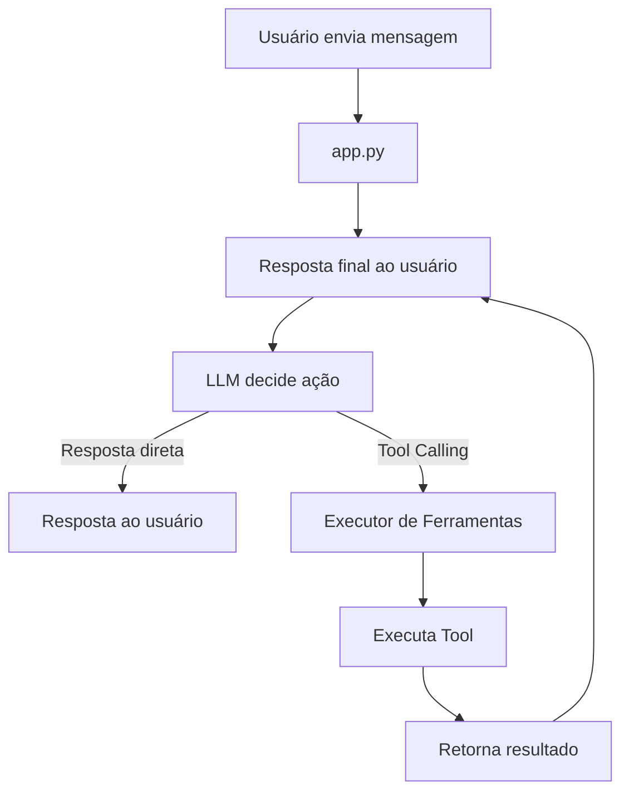

O seu README já está com uma estrutura excelente! Fiz as adições que você pediu e refinei alguns pontos para garantir que todos os requisitos do edital (como a origem do dataset, o chunking e a nova ferramenta) fiquem bem claros para o professor.

Abaixo está o README completo e atualizado. Basta copiar e colar no seu projeto:

---

# 🎓 JARVIS Acadêmico

### Assistente Inteligente Acadêmico com RAG, Tool Calling e Gestão de Estudos

---

# 📋 Sumário

* [✨ Visão Geral](https://www.google.com/search?q=%23-vis%C3%A3o-geral)
* [🚀 Funcionalidades](https://www.google.com/search?q=%23-funcionalidades)
* [🏗 Arquitetura](https://www.google.com/search?q=%23-arquitetura)
* [📁 Estrutura do Projeto](https://www.google.com/search?q=%23-estrutura-do-projeto)
* [⚙ Instalação](https://www.google.com/search?q=%23-instala%C3%A7%C3%A3o)
* [📚 Dataset](https://www.google.com/search?q=%23-dataset)
* [🛠 Ferramentas (Tools)](https://www.google.com/search?q=%23-ferramentas-tools)
* [🔄 Fluxo do Sistema](https://www.google.com/search?q=%23-fluxo-do-sistema)
* [🧪 Testes](https://www.google.com/search?q=%23-testes)
* [📝 Logs](https://www.google.com/search?q=%23-logs)
* [🤖 Tecnologias e IA Utilizadas](https://www.google.com/search?q=%23-tecnologias-e-ia-utilizadas)
* [🎥 Demonstração](https://www.google.com/search?q=%23-demonstra%C3%A7%C3%A3o)
* [👥 Autores](https://www.google.com/search?q=%23-autores)
* [📌 Observações](https://www.google.com/search?q=%23-observa%C3%A7%C3%B5es)

---

# ✨ Visão Geral

O **JARVIS Acadêmico** foi desenvolvido para a disciplina de Inteligência Artificial com o objetivo de criar um agente inteligente capaz de:

✅ Responder perguntas sobre materiais acadêmicos utilizando RAG

✅ Gerenciar agenda acadêmica

✅ Gerenciar tarefas e atividades

✅ Gerar planos de estudo automatizados (Funcionalidade 3.4)

✅ Gerar exercícios automaticamente

✅ Recomendar materiais para revisão

✅ Utilizar Tool Calling com LLM para tomada de decisão

---

# 🚀 Funcionalidades

## 📖 1. RAG (Retrieval-Augmented Generation)

O sistema:

* Carrega documentos PDF, TXT e imagens
* Realiza OCR em imagens
* Divide conteúdos em chunks
* Gera embeddings com `fastembed`
* Armazena vetores no ChromaDB
* Recupera contexto relevante para responder perguntas

---

## 📅 2. Agenda Acadêmica

Permite consultas como:

```txt
"O que tenho hoje?"
"Tenho prova amanhã?"
"Quais aulas tenho esta semana?"

```

Os dados são armazenados em SQLite.

---

## ✅ 3. Gerenciamento de Tarefas

### Operações disponíveis

* Adicionar tarefa
* Listar tarefas
* Marcar como concluída

Exemplo:

```txt
Adicionar tarefa: estudar regressão logística

```

---

## 🎯 4. Planejamento de Estudos

O sistema cruza dados da agenda, das tarefas pendentes e dos materiais indexados (RAG) para montar estratégias de estudo através da LLM.

```txt
"Monte um plano de estudos para a prova de amanhã"
"O que devo priorizar hoje?"

```

---

## 🧠 5. Melhorias de Aprendizado

* **Geração de Exercícios:** Busca contexto via RAG e cria perguntas de múltipla escolha.
* **Recomendação de Revisão:** Detecta tópicos com dificuldade e sugere arquivos específicos para estudo.

---

# 🏗 Arquitetura

# 📁 Estrutura do Projeto

```bash
jarvis_academico/
│
├── app.py
│
├── core/
│   ├── agent.py
│   ├── llm_client.py
│   └── prompts.py
│
├── tools/
│   ├── agenda.py
│   ├── rag_tool.py
│   ├── learning.py
│   ├── executor.py
│   ├── description.py
│   └── __init__.py
│
├── services/
│   ├── rag_engine.py
│   ├── file_monitor.py
│   └── ocr_processor.py
│
├── tests/
├── data/
├── logs/
├── chroma_db/
│
├── requirements.txt
├── .gitignore
└── README.md

```

---

# 🔄 Fluxo do Sistema



---

# ⚙ Instalação

## Pré-requisitos

* Python 3.10+
* Git
* Arquivo `.env` configurado com a chave da API
* Credenciais da API da LLM:
* `API_URL`
* `API_KEY`


---

## 1️⃣ Clone o repositório

```bash
git clone https://github.com/rukaaah/Jarvis-Academico-IA.git
cd jarvis-academico-ia

```

---

## 2️⃣ Crie o ambiente virtual

### Linux/macOS

```bash
python -m venv venv
source venv/bin/activate

```

### Windows

```bash
python -m venv venv
venv\Scripts\activate

```

---

## 3️⃣ Instale as dependências

```bash
pip install -r requirements.txt

```

---

## 4️⃣ Configure a API da LLM

Crie um arquivo `.env` na raiz do projeto:

```env
API_URL=url_da_llm
API_KEY=sua_chave_aqui

```

---

## 5️⃣ Execute a aplicação

```bash
streamlit run app.py

```

---

# 📚 Dataset

A pasta `data/` contém os documentos que alimentam o conhecimento do JARVIS.

* **Origem dos dados:** Materiais e PDFs disponibilizados pelo AVA (Ambiente Virtual de Aprendizagem) da disciplina.
* **Tipo de conteúdo:** Textos acadêmicos, slides de aula e anotações sobre Inteligência Artificial.
* **Quantidade Mínima:** 10 documentos.
* **Limitações:** O RAG é focado exclusivamente no escopo destes documentos. Imagens de baixíssima resolução podem sofrer degradação no OCR.

### Estratégia de Chunking

Os textos são divididos em "chunks" (pedaços) de **500 caracteres** com um pequeno overlap (sobreposição) nas bordas.
**Impacto no RAG:** Essa limitação garante que a LLM (Qwen14B) receba trechos diretos e coesos, reduzindo alucinações e evitando estourar o limite de tokens da API durante a consulta.

---

# 🛠 Ferramentas (Tools)

O Tool Calling foi implementado de forma dinâmica. A LLM avalia a entrada do usuário e decide qual ferramenta invocar e com quais parâmetros.

| # | Tool | Descrição |
| --- | --- | --- |
| 1 | `consultar_agenda` | Consulta eventos e provas |
| 2 | `listar_tarefas` | Lista tarefas pendentes |
| 3 | `adicionar_tarefa` | Cria nova tarefa |
| 4 | `concluir_tarefa` | Marca tarefa como concluída |
| 5 | `buscar_material_rag` | RAG: Busca conteúdo acadêmico |
| 6 | `adicionar_evento_agenda` | Adiciona eventos com data |
| 7 | `remover_evento_agenda` | Remove um evento pelo ID |
| 8 | `gerar_exercicios` | Cria exercícios de múltipla escolha |
| 9 | `recomendar_revisao` | Sugere materiais baseados em erros |
| 10 | `gerar_plano_estudos` | Combina RAG, agenda e tarefas para plano de estudo estratégico |

---

# 🧪 Testes

Os testes unitários e de integração foram desenvolvidos utilizando `pytest` e a biblioteca nativa `unittest.mock` para isolar a API da LLM e evitar gastos com tokens do servidor durante validações de engenharia.

## Como rodar os testes:

Certifique-se de que o ambiente virtual está ativado e execute:

```bash
pytest tests/ -v

```

### Exemplo de saída:

```txt
tests/test_agenda_tarefas.py::test_adicionar_tarefa PASSED
tests/test_agenda_tarefas.py::test_adicionar_e_remover_evento_agenda PASSED
tests/test_agent.py::test_extract_tool_calls_json_simples PASSED
tests/test_learning.py::test_gerar_plano_estudos_sucesso PASSED

```

---

# 📝 Logs

Todas as chamadas de ferramentas e comportamentos do sistema são registrados no arquivo:
`logs/tool_calls.log`

---

# 🤖 Tecnologias e IA Utilizadas

## Tecnologias e Frameworks

* **Linguagem:** Python 3.10+
* **Frontend/Interface:** Streamlit
* **Banco de Dados Relacional:** SQLite (Agenda e Tarefas)
* **Banco de Dados Vetorial:** ChromaDB (Armazenamento de Embeddings)
* **Geração de Embeddings:** FastEmbed (`BAAI/bge-small-en-v1.5`)
* **Processamento de Imagens:** OCR.space API (Leitura de imagens e esquemas)
* **Testes:** Pytest & Unittest Mocks

## Modelos de Linguagem

* **Qwen14B** (Modelo principal, obrigatório do projeto)

## IAs Utilizadas no Desenvolvimento

Conforme permitido pelas diretrizes do edital, usamos IAs como apoio ao longo do desenvolvimento:

* **ChatGPT / Gemini:** Auxílio na estruturação de prompts do sistema, criação de lógica de extração JSON (Tool Calling), escrita de testes automatizados, auxílio na criação e revisão da documentação.
* **GitHub Copilot / Cursor:** Autocomplete rápido, refatoração de funções rotineiras (como manipulação de banco SQLite) e formatação geral do código.

---

# 👥 Autores

| Nome | GitHub |
| --- | --- |
| Pedro Lucas Cremonini | [https://github.com/rukaaah](https://github.com/rukaaah) |
| Angelo Antônio de Souza | [https://github.com/angelo-acds](https://github.com/angelo-acds) |

---

# 📌 Observações

Este projeto foi desenvolvido exclusivamente para fins acadêmicos como trabalho prático da disciplina de Inteligência Artificial.